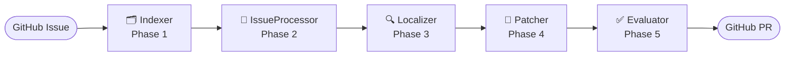
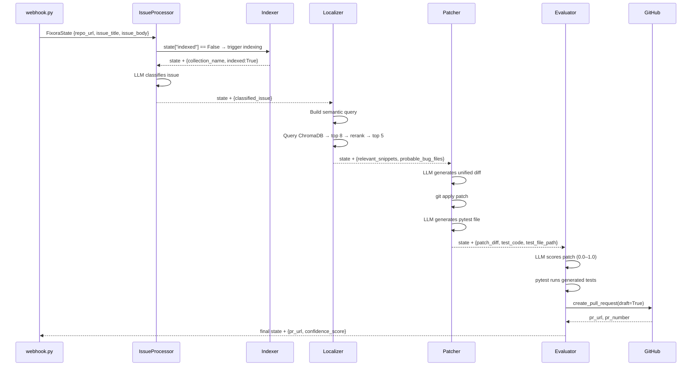

# 🤖 Fixora — AI Agents Explained (Step by Step)

All 5 agents run in sequence. Each one receives `FixoraState`, does its job, and returns an updated state.

---

## Pipeline Overview



---

## 🗂️ Agent 1 — `indexer.py` (Phase 1: Repository Indexer)

**Job:** Clone the repo → split code into chunks → store as vector embeddings in ChromaDB.

### Step-by-Step

```
Step 1: Validate input
    └─ If repo_url is missing → return error, stop pipeline

Step 2: Derive ChromaDB collection name from URL
    └─ "https://github.com/owner/my-repo" → "owner_my_repo"
    └─ Replaces - and . with _, max 60 chars

Step 3: Clone the repository (or pull if already cloned)
    └─ Uses repo_utils.clone_repo()
    └─ Shallow clone (depth=1) for speed
    └─ Saves to temp dir: /tmp/fixora_repos/owner_my_repo/

Step 4: Chunk all source files
    └─ Uses chunker.chunk_repository()
    └─ Walks all .py, .js, .ts, .java etc. files
    └─ Splits each file into 60-line chunks with 15-line overlap
    └─ Returns list of {file_path, start_line, end_line, snippet}

Step 5: Build vector index in ChromaDB
    └─ Uses vector_store.build_index()
    └─ Converts each chunk → TextNode → embedding vector
    └─ Stores in ChromaDB collection named after the repo

Step 6: Return updated state
    └─ repo_local_path, collection_name, indexed=True
    └─ current_phase = "index_done"
```

### Code Walkthrough

```python
def _collection_name(repo_url: str) -> str:
    # "https://github.com/owner/my-repo.git"
    slug = repo_url.rstrip("/").split("/")[-2:]   # ["owner", "my-repo"]
    return "_".join(slug).replace("-","_")[:60]   # "owner_my_repo"

async def indexer_node(state: FixoraState) -> FixoraState:
    repo_url = state.get("repo_url", "")
    if not repo_url:                              # Guard check
        return {**state, "error": "indexer: repo_url is missing"}

    collection_name = _collection_name(repo_url)

    local_path = clone_repo(repo_url)             # Step 3
    documents = chunk_repository(local_path)      # Step 4
    build_index(documents, collection_name)       # Step 5

    return {                                      # Step 6
        **state,
        "repo_local_path": local_path,
        "collection_name": collection_name,
        "indexed": True,
        "current_phase": "index_done",
    }
```

### Why it matters
> Without indexing, the Localizer has no way to search the codebase. This is the foundation of the RAG (Retrieval-Augmented Generation) architecture.

---

## 🧠 Agent 2 — `issue_processor.py` (Phase 2: Issue Classifier)

**Job:** Use LLM to read the GitHub issue and classify it into structured JSON — type, severity, component, keywords.

### Step-by-Step

```
Step 1: Check if repo is indexed
    └─ If state["indexed"] == False → call indexer_node first
    └─ This makes issue_processor self-sufficient

Step 2: Build the classification prompt
    └─ Injects issue_title and issue_body into CLASSIFICATION_PROMPT
    └─ Prompt asks LLM to return ONLY a valid JSON object

Step 3: Call LLM asynchronously
    └─ llm.ainvoke(prompt)
    └─ Uses get_llm_client() → Groq/OpenAI LangChain client

Step 4: Parse LLM response
    └─ Strip markdown code fences (```json ... ```) if present
    └─ json.loads(content) → Python dict

Step 5: Return structured classification
    └─ classified_issue = {type, component, severity, summary, keywords}
    └─ current_phase = "parsed"

Step 6 (fallback): If JSON parsing fails
    └─ Return default: {type:"bug", severity:"medium", component:"unknown"}
    └─ Pipeline continues degraded — never crashes
```

### Code Walkthrough

```python
CLASSIFICATION_PROMPT = """
You are a senior software engineer triaging a GitHub issue.
Respond with ONLY a valid JSON object. No extra text.

Issue Title: {title}
Issue Body: {body}

JSON schema:
{{
  "type": "bug | enhancement | refactor | question | other",
  "component": "affected module/file/class",
  "severity": "critical | high | medium | low",
  "summary": "One-sentence description",
  "keywords": ["list", "of", "terms"]
}}
"""

async def issue_processor_node(state: FixoraState) -> FixoraState:
    # Step 1: Trigger indexing if not done
    if not state.get("indexed"):
        state = await indexer_node(state)
        if state.get("error"):
            return state

    # Step 2-3: Build prompt and call LLM
    llm = get_llm_client()
    prompt = CLASSIFICATION_PROMPT.format(title=title, body=body)
    response = await llm.ainvoke(prompt)

    # Step 4: Parse response
    content = response.content.strip("```json").strip("```").strip()
    classified = json.loads(content)             # May raise JSONDecodeError

    return {**state, "classified_issue": classified, "current_phase": "parsed"}

    # Step 6: Fallback on JSON error
    except json.JSONDecodeError:
        return {**state, "classified_issue": {
            "type": "bug", "component": "unknown",
            "severity": "medium", "summary": title,
            "keywords": [],
        }}
```

### Example output
```json
{
  "type": "bug",
  "component": "calculator.py",
  "severity": "high",
  "summary": "add() returns subtraction instead of addition",
  "keywords": ["add", "calculator", "arithmetic", "operator"]
}
```

---

## 🔍 Agent 3 — `localizer.py` (Phase 3: Bug Localizer)

**Job:** Build a smart search query from the classification, search ChromaDB for the most relevant code chunks, deduplicate and re-rank results.

### Step-by-Step

```
Step 1: Validate collection_name exists in state
    └─ If missing → return error

Step 2: Build rich semantic query
    └─ Combines: issue_title + summary + component + keywords
    └─ Example: "add() returns wrong result add function returns subtraction
                 calculator.py add calculator arithmetic"

Step 3: Query ChromaDB (vector similarity search)
    └─ vector_store.query_index(query, collection_name, top_k=8)
    └─ Returns 8 chunks with cosine similarity scores (0.0–1.0)

Step 4: Deduplicate by file path
    └─ Same file may appear multiple times (different chunks)
    └─ Keep only the highest-scoring chunk per file

Step 5: Re-rank by score, take top 5
    └─ Sort descending by similarity score
    └─ Keep RERANK_TOP=5 results

Step 6: Return ranked snippets
    └─ relevant_snippets = [{file_path, start_line, end_line, snippet, score}]
    └─ probable_bug_files = [file paths ordered by relevance]
    └─ current_phase = "located"
```

### Code Walkthrough

```python
TOP_K = 8        # retrieve 8 from ChromaDB
RERANK_TOP = 5   # keep top 5 after dedup

def _build_query(state: FixoraState) -> str:
    classified = state.get("classified_issue", {})
    title    = state.get("issue_title", "")
    summary  = classified.get("summary", "")
    component = classified.get("component", "")
    keywords = " ".join(classified.get("keywords", []))
    return f"{title} {summary} {component} {keywords}".strip()

async def localizer_node(state: FixoraState) -> FixoraState:
    query = _build_query(state)               # Step 2
    snippets = query_index(query, collection_name, top_k=TOP_K)  # Step 3

    # Step 4: Deduplicate — keep best chunk per file
    seen: dict[str, dict] = {}
    for s in snippets:
        fp = s["file_path"]
        if fp not in seen or s["score"] > seen[fp]["score"]:
            seen[fp] = s

    # Step 5: Re-rank, take top 5
    ranked = sorted(seen.values(), key=lambda x: x["score"], reverse=True)[:RERANK_TOP]
    probable_files = [s["file_path"] for s in ranked]

    return {**state, "relevant_snippets": ranked, "probable_bug_files": probable_files}
```

### Why top_k=8 then RERANK_TOP=5?
> We fetch 8 to have enough candidates for deduplication. After removing duplicate files, we keep only the 5 highest-confidence locations — this prevents sending redundant context to the LLM.

---

## 🔧 Agent 4 — `patcher.py` (Phase 4: Patch + Test Generator)

**Job:** Use LLM to generate a unified diff fixing the bug, apply it to the local repo, then generate a pytest test file.

### Step-by-Step

```
Step 1: Guard check
    └─ If no relevant_snippets → return error (can't patch without context)

Step 2: Format code snippets for the prompt
    └─ _format_snippets() → Markdown with file paths + line ranges + code

Step 3: Generate unified diff (LLM call #1)
    └─ PATCH_PROMPT: "produce a minimal unified diff fixing this bug"
    └─ LLM responds with raw diff starting with "---"

Step 4: Apply patch to local repo
    └─ validate: patch must start with "---"
    └─ code_applicator.apply_patch():
       ├─ Write diff to .fixora_patch.diff
       ├─ git apply --check (dry-run — verify it's safe)
       ├─ git apply (actually apply)
       └─ delete temp .diff file

Step 5: Generate pytest test file (LLM call #2)
    └─ TEST_PROMPT: "write pytest covering bug, happy path, edge case"
    └─ Strip markdown fences if LLM wraps in ```python
    └─ _is_valid_python(test_code) — validate with ast.parse()

Step 6: Write test file to repo
    └─ write_test_file() → tests/fixora/test_issue_{N}.py

Step 7: Return updated state
    └─ patch_diff, patch_applied, test_code, test_file_path
    └─ current_phase = "patched"
```

### Code Walkthrough

```python
PATCH_PROMPT = """
You are an expert software engineer. Fix the bug below.
Produce a minimal unified diff (git diff format).
Only modify what is necessary.
Respond with ONLY the raw diff starting with ---
"""

TEST_PROMPT = """
Write a pytest test suite covering:
- The bug scenario (regression test)
- The happy path
- At least one edge case
Respond with ONLY Python test file content.
"""

async def patcher_node(state: FixoraState) -> FixoraState:
    if not snippets:
        return {**state, "error": "patcher: no snippets to patch"}

    # Step 3: Generate patch
    patch_response = await llm.ainvoke(patch_prompt)
    patch_diff = patch_response.content.strip()

    # Step 4: Apply patch
    patch_applied = False
    if patch_diff.startswith("---"):             # Sanity check
        patch_applied = apply_patch(repo_path, patch_diff)

    # Step 5: Generate tests
    test_response = await llm.ainvoke(test_prompt)
    test_code = test_response.content.strip()
    if test_code.startswith("```"):              # Strip markdown fences
        test_code = "\n".join(test_code.split("\n")[1:]).strip("` \n")

    # Step 6: Write test file
    test_file_path = write_test_file(repo_path, issue_number, test_code)

    return {**state, "patch_diff": patch_diff, "patch_applied": patch_applied,
            "test_code": test_code, "test_file_path": test_file_path}
```

### Example patch output
```diff
--- a/calculator.py
+++ b/calculator.py
@@ -1,3 +1,3 @@
 def add(a, b):
-    return a - b  # BUG
+    return a + b
```

---

## ✅ Agent 5 — `evaluator.py` (Phase 5: Evaluator + PR Creator)

**Job:** Score the patch quality using LLM, run the generated tests, build a rich PR description, and create a GitHub Pull Request.

### Step-by-Step

```
Step 1: Guard check
    └─ If no patch_diff → return error

Step 2: LLM self-evaluation (LLM-as-a-judge)
    └─ EVAL_PROMPT: "score this patch 0.0 to 1.0"
    └─ Scoring rubric:
       ├─ Does it fix the bug? (+0.4)
       ├─ Is it minimal and safe? (+0.3)
       ├─ Is the test meaningful? (+0.2)
       └─ Is the diff well-formed? (+0.1)
    └─ Returns: {"score": 0.88, "reasoning": "Clean minimal fix"}

Step 3: Run generated pytest tests
    └─ subprocess.run(["pytest", test_file_path, "-v", "--timeout=30"])
    └─ Returns True if all tests pass
    └─ Timeout=60s to prevent hanging

Step 4: Build PR description (Markdown)
    └─ _build_pr_body():
       ├─ Issue summary (title, type, severity, component)
       ├─ Suspected bug file locations
       ├─ Test results (✅ passed / ⚠️ failed)
       └─ Confidence score (e.g. "88% — Clean minimal fix")

Step 5: Create GitHub Pull Request
    └─ create_pull_request():
       ├─ Branch: fixora/issue-{number}
       ├─ Creates branch if it doesn't exist
       ├─ draft=True (human MUST review before merge)
       └─ Returns (pr_url, pr_number)

Step 6: Return final state
    └─ confidence_score, test_passed, pr_url, pr_number
    └─ current_phase = "done"
```

### Code Walkthrough

```python
EVAL_PROMPT = """
Score the patch from 0.0 to 1.0.
Consider:
- Fixes the bug? (+0.4)
- Minimal and safe? (+0.3)
- Test meaningful? (+0.2)
- Diff well-formed? (+0.1)
Respond ONLY: {"score": <0.0-1.0>, "reasoning": "<one sentence>"}
"""

async def evaluator_node(state: FixoraState) -> FixoraState:
    # Step 2: LLM scores the patch
    confidence, reasoning = await _score_patch(state)

    # Step 3: Run pytest
    test_passed = _run_tests(state["test_file_path"], state["repo_local_path"])

    # Step 4+5: Build PR body and create GitHub PR
    pr_body = _build_pr_body(state, confidence, reasoning, test_passed)
    pr_url, pr_number = create_pull_request(
        repo_url=repo_url,
        branch_name=f"fixora/issue-{issue_number}",
        title=f"[Fixora] Fix: {issue_title} (Issue #{issue_number})",
        body=pr_body,
        draft=True,        # ← Always draft — human reviews before merge
    )

    return {**state, "confidence_score": confidence,
            "test_passed": test_passed, "pr_url": pr_url, "pr_number": pr_number,
            "current_phase": "done"}
```

### Example PR body generated
```markdown
## 🤖 Fixora Automated Fix
Closes #42

### 🐛 Issue Summary
**add() returns wrong result**
add() uses subtraction operator instead of addition.
- Type: bug | Severity: high | Component: `calculator.py`

### 🔍 Suspected Bug Locations
- `calculator.py`

### 🧪 Test Results
✅ All tests passed

### 📊 Confidence Score
88% — Clean minimal fix that directly addresses the operator error
```

---

## 🔁 Complete Agent Interaction Flow



---

## 🎯 Quick Reference: What Each Agent Owns

| Agent | Reads from State | Writes to State |
|-------|-----------------|-----------------|
| **Indexer** | `repo_url` | `repo_local_path`, `collection_name`, `indexed` |
| **IssueProcessor** | `issue_title`, `issue_body` | `classified_issue` |
| **Localizer** | `classified_issue`, `collection_name` | `relevant_snippets`, `probable_bug_files` |
| **Patcher** | `relevant_snippets`, `classified_issue` | `patch_diff`, `patch_applied`, `test_code`, `test_file_path` |
| **Evaluator** | `patch_diff`, `test_file_path` | `confidence_score`, `test_passed`, `pr_url`, `pr_number` |
