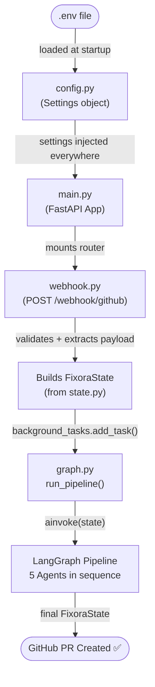
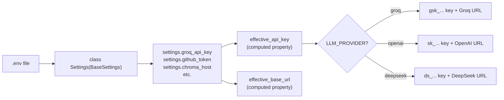
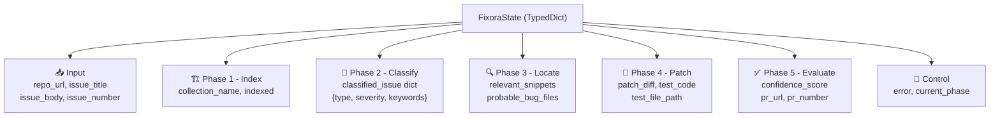
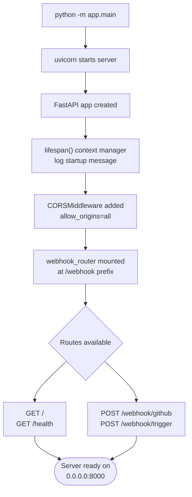
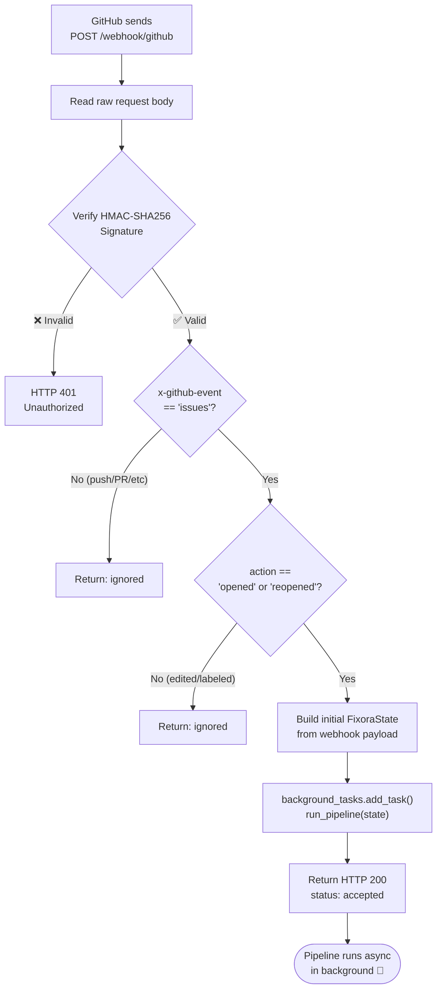
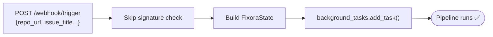
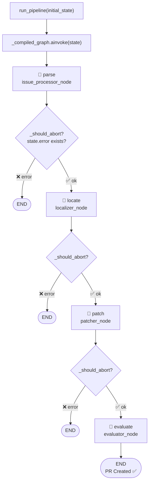
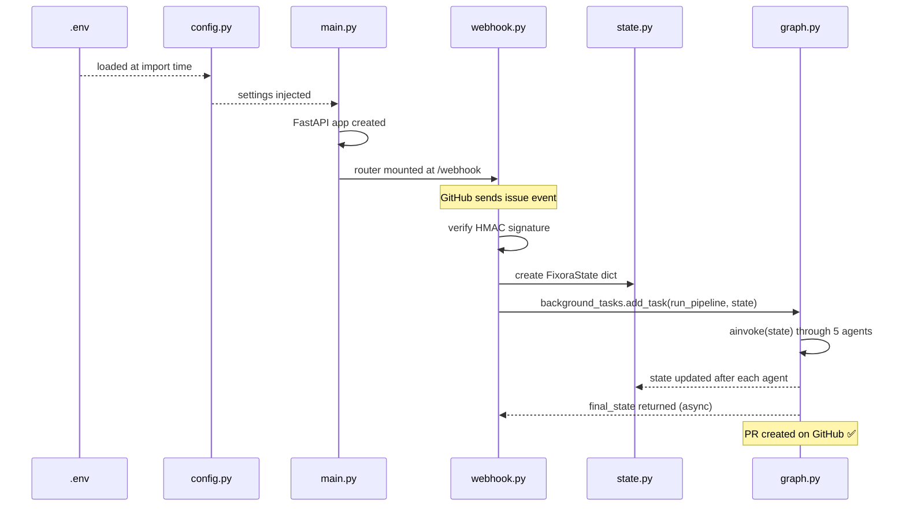

# 🔄 Fixora — Core Workflow Explained

Step-by-step breakdown of the 5 core files and how they connect...

---

## 📦 The 5 Core Files & Their Roles

| File | Role | Layer |
|------|------|-------|
| `config.py` | Loads all `.env` settings — API keys, hosts, model names | Foundation |
| `state.py` | Defines shared data contract (`FixoraState`) passed between agents | Data Schema |
| `main.py` | Starts the FastAPI server, registers routes | Entry Point |
| `webhook.py` | Receives GitHub events, validates them, triggers pipeline | Gateway |
| `graph.py` | Wires 5 agents into a sequential pipeline with error routing | Orchestrator |

---

## 🗺️ Full System Flow



---

## Step 1 — `config.py` (Foundation)

**Loads when:** Python imports any module that does `from app.config import settings`

**What it does:** Reads `.env` file into typed Python fields using Pydantic.



**Key design:** Computed properties mean one place to control which LLM is used — change `LLM_PROVIDER` in `.env` and everything updates automatically.

---

## Step 2 — `state.py` (Shared Memory)

**Used by:** Every agent as their input AND output contract.

**What it does:** Defines `FixoraState` — a `TypedDict` (typed dictionary) that flows through the entire pipeline. Each agent reads some fields and writes new ones.



**Update pattern used by every agent:**
```python
return {**state, "new_field": value}   # spread existing + add new fields
```

---

## Step 3 — `main.py` (Entry Point)

**Runs when:** `python -m app.main` is executed.

**What it does:** Creates the FastAPI app, configures middleware, and registers the webhook router.



---

## Step 4 — `webhook.py` (Event Gateway)

**Called when:** GitHub sends a POST to `/webhook/github` (or you POST to `/webhook/trigger`).

**What it does:** The security gate + pipeline trigger.



**Manual test trigger flow:**


---

## Step 5 — `graph.py` (Orchestrator)

**Called when:** `run_pipeline(initial_state)` is invoked by `webhook.py`.

**What it does:** Runs the 5 agents in sequence. After each agent, checks if an error occurred.



> **Note:** `indexer_node` is NOT a graph node — it's called **from inside** `issue_processor_node` if `state['indexed']` is False.

---

## 🔗 How All 5 Files Connect Together



---

## 🧩 Single-Line Summary of Each File

| File | One-liner |
|------|-----------|
| `config.py` | **"Read `.env`, expose as typed Python properties"** |
| `state.py` | **"The baton passed between all agents"** |
| `main.py` | **"Boot the server, plug in routes"** |
| `webhook.py` | **"Verify GitHub events, fire pipeline in background"** |
| `graph.py` | **"Chain 5 agents with error checkpoints"** |
