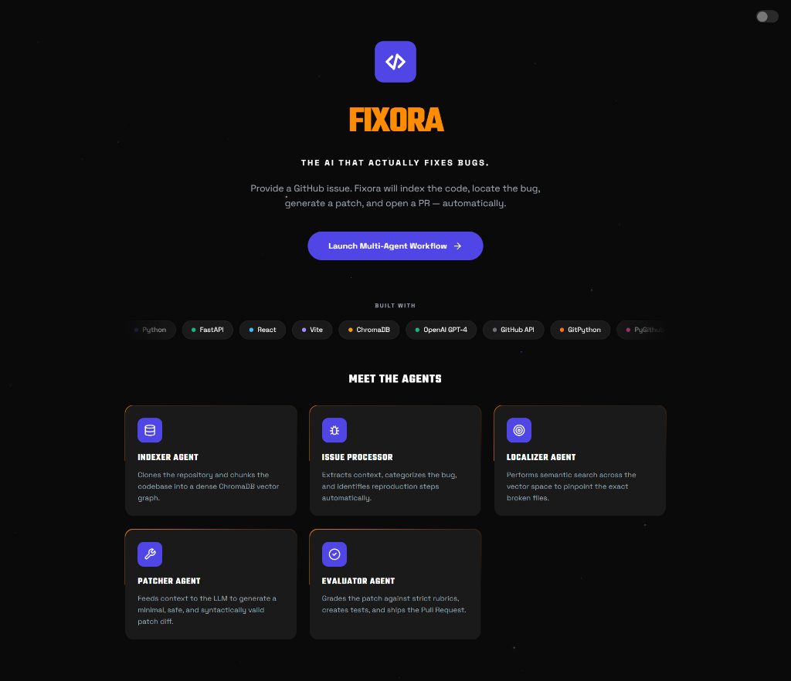
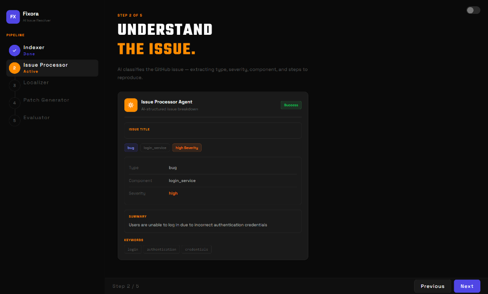
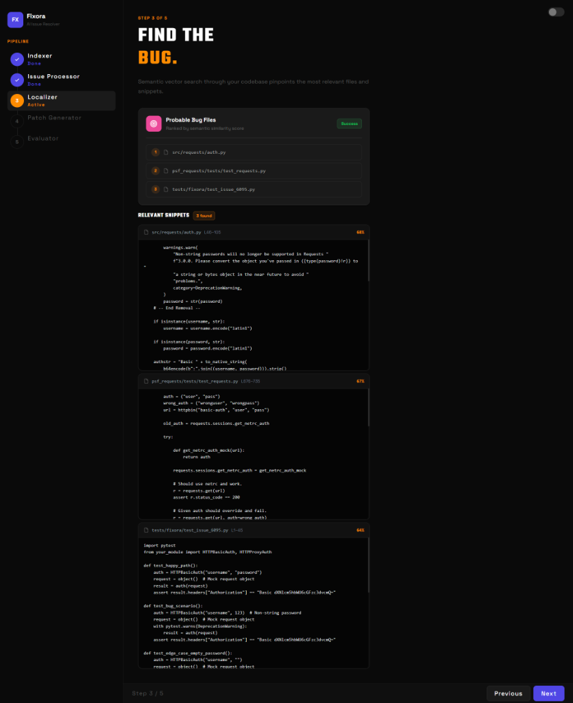
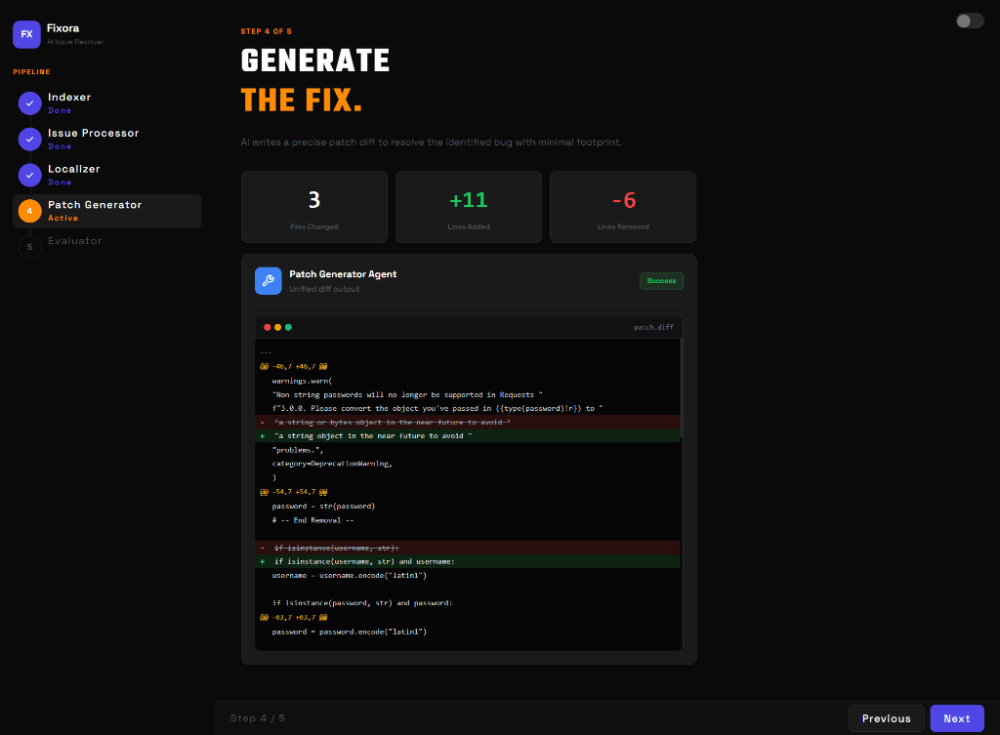
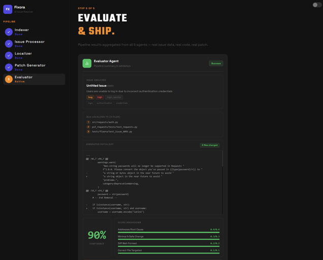
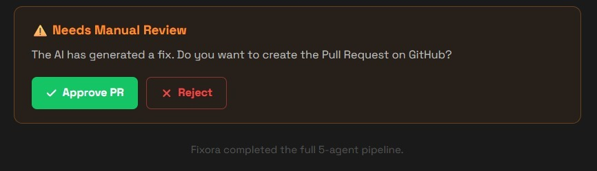
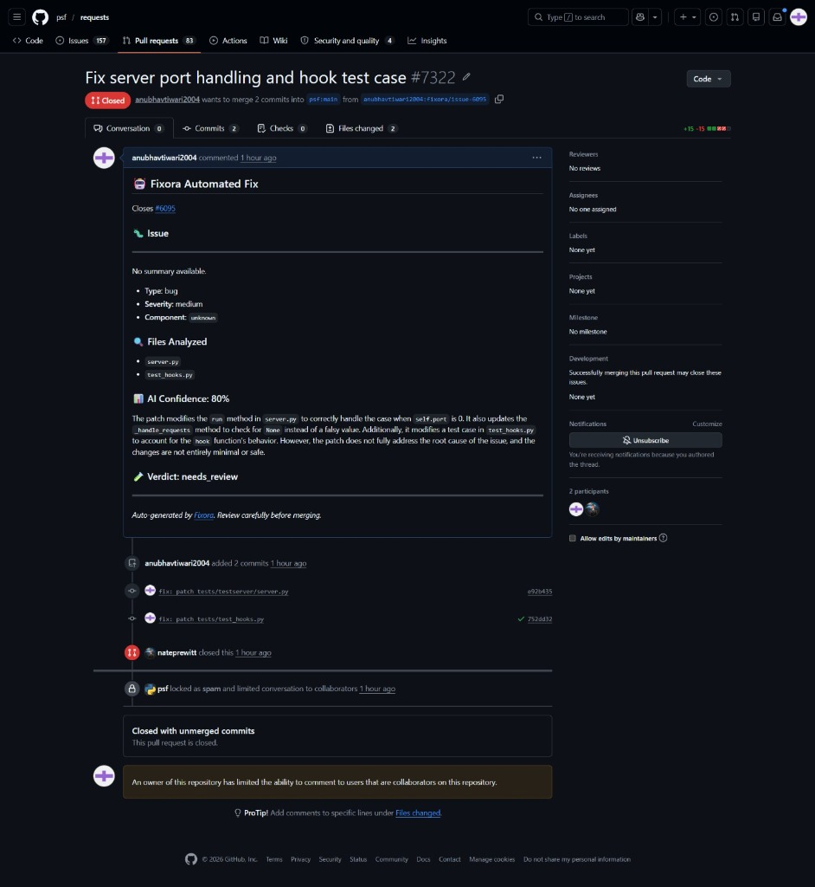

# Fixora - AI-Powered GitHub Issue Resolution Agent

The AI that actually fixes bugs. 

Fixora is an autonomous multi-agent system that reads GitHub Issues, understands your codebase, generates patches, and opens Pull Requests automatically. 

Provide a GitHub issue. Fixora will index the code, locate the bug, generate a patch, and open a PR.

---

## Multi-Agent Workflow

Fixora operates on a 5-step pipeline, orchestrating specialized AI agents to resolve issues seamlessly from end to end:




### 1. Indexer Agent

Clones the repository and chunks the codebase into a dense ChromaDB vector graph. 

### 2. Issue Processor Agent


Extracts context from the GitHub issue, categorizes the bug based on type, component, and severity, and identifies reproduction steps automatically.

### 3. Localizer Agent


Performs semantic search across the vector space to pinpoint the exact broken files and relevant code snippets causing the issue.

### 4. Patcher Agent


Feeds the localized context to the LLM to generate a minimal, safe, and syntactically valid patch diff.

### 5. Evaluator Agent



Grades the generated patch against strict rubrics, creates tests to verify the fix, and ships the Pull Request directly to GitHub.



Fixora automatically generates a fully formatted GitHub Pull Request containing a detailed summary of the issue, files analyzed, and the AI's confidence score before merging.

---

## Built With

- Python
- FastAPI
- React
- Vite
- ChromaDB
- OpenAI GPT-4
- GitHub API
- GitPython
- PyGithub

---

## Quick Start

### 1. Clone and Configure

```bash
git clone https://github.com/your-org/fixora.git
cd fixora
cp .env.example .env
# Edit .env and fill in your API keys
```

### 2. Run with Docker (Recommended)

```bash
docker-compose up --build
```

- Fixora API: http://localhost:8000
- API Docs: http://localhost:8000/docs
- ChromaDB: http://localhost:8001
- Frontend (if applicable): http://localhost:3000

### 3. Run Locally (Development)

```bash
pip install -r requirements.txt
python -m app.main
```

---

## Environment Variables

| Variable | Description |
|---|---|
| OPENAI_API_KEY | OpenAI API key |
| DEEPSEEK_API_KEY | DeepSeek API key (if using DeepSeek) |
| LLM_PROVIDER | openai or deepseek |
| LLM_MODEL | e.g., gpt-4o or deepseek-coder |
| GITHUB_TOKEN | Personal Access Token with repo scope |
| GITHUB_WEBHOOK_SECRET | The secret set in your GitHub webhook settings |
| CHROMA_HOST | ChromaDB host (default: localhost) |
| CHROMA_PORT | ChromaDB port (default: 8001) |

---

## API Endpoints

| Method | Path | Description |
|---|---|---|
| GET | /health | Health check |
| POST | /webhook/github | GitHub webhook receiver |
| POST | /webhook/trigger | Manual pipeline trigger (testing) |

### Manual Trigger Example

```bash
curl -X POST http://localhost:8000/webhook/trigger \
  -H "Content-Type: application/json" \
  -d '{
    "repo_url": "https://github.com/owner/repo.git",
    "issue_number": 42,
    "issue_title": "add() returns wrong result",
    "issue_body": "The add function subtracts instead of adding."
  }'
```

---

## GitHub Webhook Setup

1. Go to your target repository Settings -> Webhooks -> Add webhook
2. Payload URL: https://<your-server>/webhook/github
3. Content type: application/json
4. Secret: Paste the value of GITHUB_WEBHOOK_SECRET
5. Events: Select Issues
6. Save

---

## Running Tests

```bash
# Install development dependencies
pip install -r requirements.txt

# Run all tests
pytest tests/ -v

# Run only integration tests
pytest tests/test_integration.py -v
```

---

## Project Structure

```
fixora/
├── app/
│   ├── agents/           # 5 LangGraph nodes (one per phase)
│   │   ├── indexer.py        # Phase 1: Repo cloning + Chroma indexing
│   │   ├── issue_processor.py # Phase 2: Issue classification
│   │   ├── localizer.py      # Phase 3: RAG retrieval
│   │   ├── patcher.py        # Phase 4: Patch + test generation
│   │   └── evaluator.py      # Phase 5: Scoring + PR creation
│   ├── tools/            # Reusable utilities
│   │   ├── repo_utils.py     # Git clone + file listing
│   │   ├── chunker.py        # LlamaIndex code chunker
│   │   ├── vector_store.py   # Chroma read/write
│   │   ├── llm_client.py     # OpenAI/DeepSeek wrapper
│   │   ├── github_client.py  # PyGithub wrapper
│   │   └── code_applicator.py # Patch + commit utilities
│   ├── config.py         # Pydantic settings
│   ├── state.py          # Shared LangGraph state
│   ├── graph.py          # LangGraph wiring
│   ├── main.py           # FastAPI app
│   └── webhook.py        # Webhook router
├── frontend/             # React and Vite interactive frontend
├── tests/
│   └── test_integration.py
├── Dockerfile
├── docker-compose.yml
├── requirements.txt
└── .env.example
```

---

## License

MIT
